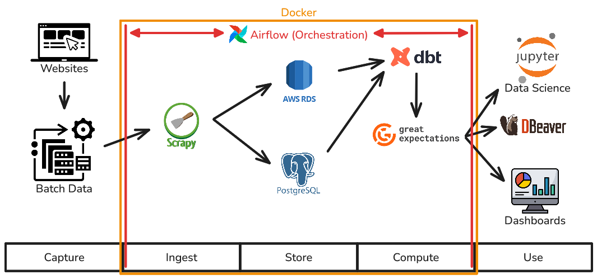

# Introduction

Analyze the following hypothetical problem:

"It was verified that the company did not meet the forecasted sales of its most sold items, that are notebooks, smartphones, tablets, headsets and consoles. Suspecting that rival e-commerce might have a pricing advantage, it's essential to monitor these prices to see whether there is or not such advantage and what its size is. The objective here is to build a pipeline in order to collect product data from an e-commerce website."

Having the problem in mind, let's go to the solutions.

## Setup and instructions to run it:

First things first: bear in mind that this project is supposed to be run on either Linux or WSL2 (for Windows). Make sure to clone it into a Linux-based folder.

1. Install Docker (+ Docker Compose)
2. Run `git clone https://github.com/lucasrangelt/AdvancedProjectB---Scraping.git`
3. Run the following command with the terminal open on the project root folder:
```"mv .env.example .env; mv dbt_project/profiles.yml.example dbt_project/profiles.yml"```
4. Generate a Fernet key for Airflow using the command `docker run --rm python:3.11-slim /bin/bash -c \
"pip install cryptography -q && python3 -c 'from cryptography.fernet import Fernet; print(Fernet.generate_key().decode())'"` and paste it inside the .env file.
5. Insert the command `docker compose up -d` with the terminal open on the project root folder (or build the containers using your preferred tool, like the VS Code extension)
6. Define a daily working time for the file dags/scrapy_pipeline.py, or open the Airflow interface on your browser (link: http://localhost:8081/), insert "airflow" as both username and password (ideally you should change these credentials later), go to "dags" and run the scraper manually.

### System Architecture Diagram



# Chosen Tools

### Coding
- I used **VS Code** as my programming IDE for many languages like **Python**, **Yaml**, **Jinja**, **SQL**, etc.
- I used **Python** to write files from Scrapy, Airflow and many others.
- I used **SQL** to write queries for my databases.

### Infrastructure
- I used **WSL2** (Windows Subsystem for Linux) as a development environment, due to its superior speed and the fact that it is Docker's native engine.
- I used **Docker** to solve local and global dependency issues (dependency hell) and allow it to be executed on any machine.
- I used **PostgreSQL** as my database to store product data that is extracted from Scrapy.
- I used **DBeaver** to visualize both my local and cloud-based databases.

### Extract, Load, Transform
- I used **Scrapy** to collect data from multiple sites.
- I used **Data Build Tool (dbt)** to model and manipulate data with idempotency in a Medallion Architecture and create a Star Schema.
- I used **Great Expectations** in order to ensure the quality of the data to be inserted on the final tables.

### Orchestration
- I used **Airflow** to orchestrate and execute multiple interdependent tasks on fixed hour, seeking to know when and how any of them could come to fail.

### Cloud and Security
- I used **GitHub** to host my project for everyone's visibility and accessibility.
- I used **GitHub Actions** in order to ensure that my code will run with no typos and/or integration errors, therefore bringing CI/CD (Continuous Integration and Continuous Deployment) to the project.
- I used **.env**, **GitHub Secrets** and **AWS Secrets Manager** in order to ensure credentials security.
- I used **AWS** and its tools of **RDS, ECS/Fargate, ECR, IAM**, among others in order to deploy and keep my database on the cloud, guaranteeing that the project could work remotely (Hybrid Architecture).

### Others
- I used **Google Gemini** as an auxiliary tool for debugging and code optimization. I also used it in order to understand the many different uses and applications of the chosen tools.

**My e-mail: lucasrangel2011@gmail.com**

**My LinkedIn: https://www.linkedin.com/in/lucas-rangel-tietbohl-29791237b/**

To see the step-by-step development process and my learning journey as well as credits, references and extras, check out the [Journal](Journal.md)