# Introdução

Analise o seguinte problema hipotético:

"Foi verificado que a empresa não está tendo a quantidade de vendas que esperava em relação aos seus produtos mais vendidos, que são notebooks, smartphones, tablets, headsets e consoles. Com suspeitas de que as E-commerce rivais tenham uma vantagem atrativa em relação aos preços, faz-se necessário verificar esses preços para conferir se há ou não essa vantagem e qual o tamanho dela. O objetivo seria construir uma pipeline para coletar dados de produtos em um site de e-commerce."

Tendo o problema em mente, vamos às soluções.

# Ferramentas Escolhidas

- Usei **VS Code** como meu IDE para programar em várias linguagens como **Python**, **Yaml**, **Jinja** e **SQL**.
- Usei **WSL2** (ambiente virtual do Linux) para armazenar meu projeto, devido a velocidade superior e ao fato de ser o motor nativo do Docker.
- Usei **Docker** para resolver problemas de dependências locais e globais, além de possibilitar que o sistema seja executado em qualquer máquina.
- Usei **PostgreSQL** como base de dados para armazenar as informações coletadas dos produtos através do Scrapy.
- Usei **DBeaver** para visualizar minhas bases de dados locais e da nuvem.
- Usei **Python** para programar os arquivos do Scrapy, Airflow, entre outros.
- Usei **Scrapy** para coletar os dados de diferentes sites.
- Usei **SQL** para criar minhas bases de dados.
- Usei **Data Build Tool (dbt)** para modelar, orquestrar, manipular dados em arquitetura Medallion e criar uma Star Schema.
- Usei **Great Expectations** a fim de garantir a qualidade dos dados a serem inseridos na tabela final.
- Usei **Airflow** para orquestrar e executar em horário fixo múltiplas tarefas dependentes entre si, buscando saber onde e como qualquer delas pode vir a falhar.
- Usei **GitHub** para subir meu projeto e torná-lo acessível a todos.
- Usei **GitHub Actions** para garantir que o código funcione sem erros de digitação e/ou integração, trazendo assim a CI/CD (integração e desenvolvimento contínuo) para o projeto.
- Usei **.env**, **GitHub Secrets** e **AWS Secrets Manager** para garantir a segurança das minhas credenciais.
- Usei **AWS** e suas ferramentas de **RDS, ECS/Fargate, ECR, IAM**, entre outros para subir e manter minha base de dados na nuvem, e garantir que o projeto possa rodar de forma remota.
- Usei **Google Gemini** como ferramenta de auxílio para solucionar alguns erros de sintaxe e fazer a depuração (debug) de alguns erros/logs. Também usei para entender os vários usos e aplicações das ferramentas aplicadas.

# Log e Processo de Desenvolvimento

Dias anteriores: Planejei, estudei e tentei compreender como funciona a arquitetura de um projeto como um todo (visão macro).

Dia 31/12: Planejei, trabalhei no Scrapy e fui introduzido ao WSL2.

### Diagrama de Arquitetura do Sistema

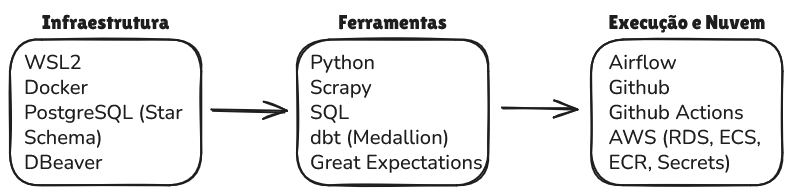

Dia 1: Planejei, trabalhei no Scrapy, ~~integrei Playwright ao programa~~ e integrei WSL2 ao VS Code.

Dia 2: Planejei, instalei o Docker, movi meu projeto para \\wsl$ e remapeei o repositório do GitHub ao novo local do projeto.

Dia 3: Planejei, instalei um ambiente virtual para evitar "dependency hell" e Dev Containers para minhas extensões.

Dia 4: Trabalhei para integrar toda a principal infraestrutura (Windows, WSL2, VS Code, .venv, Docker, GitHub, PostgreSQL).

Dia 5: Terminei de integrar toda a principal infraestrutura, corrigindo bugs e erros de mapeamento no GitHub.

Dia 6: Integrei o scraper e DBeaver com o PostgreSQL do Docker.

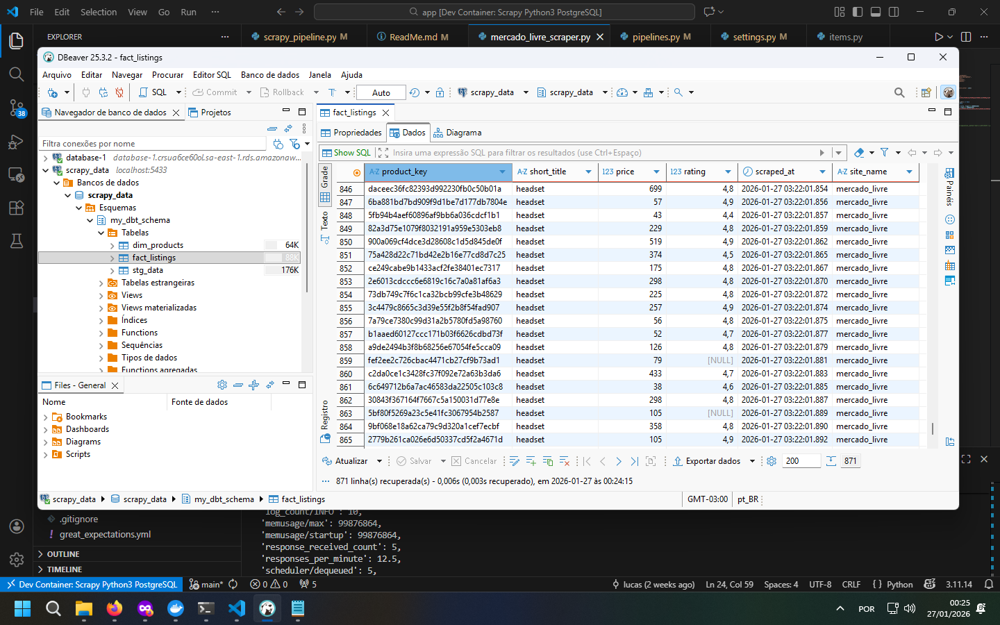

Dia 7: Organizei, testei e corrigi bugs no scraper.

Dia 8: Planejei, editei, testei o scraper e instalei as bibliotecas de dbt e Great Expectations.

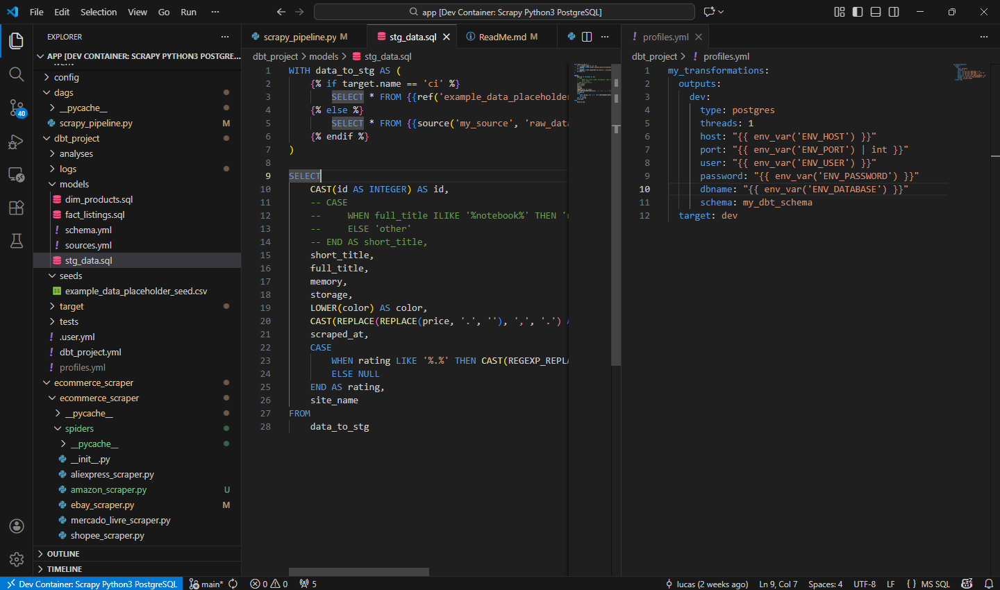

Dia 9: Planejei, criei pastas para o dbt e utilizei dbt para organizar dados e implementar uma Star Schema.

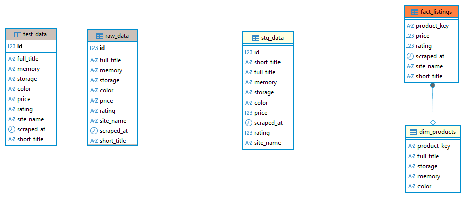

Dia 10: Implementei Great Expectations do começo ao fim.

Dia 11: Corrigi bugs e erros no Great Expectations.

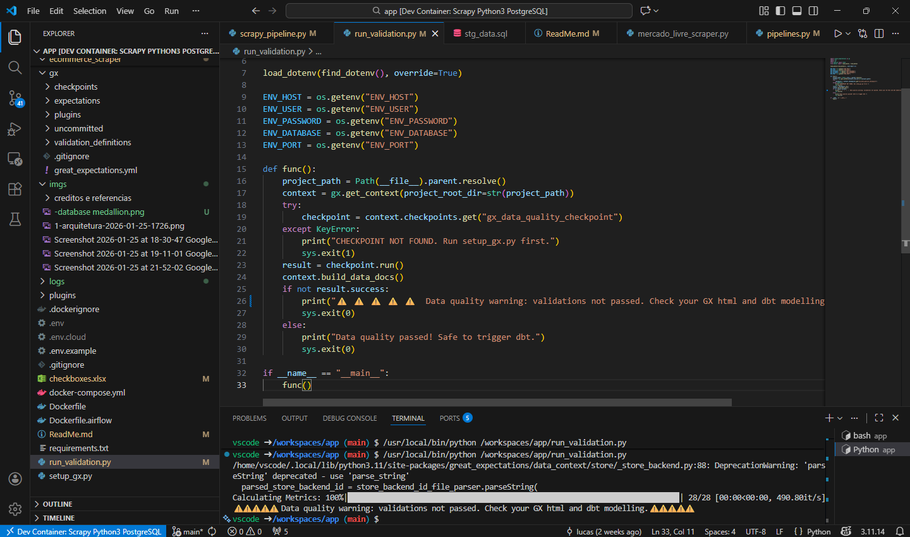

Dia 12: Comecei a preparar a infraestrutura do Airflow.

Dia 13: Corrigi bugs e terminei de instalar a infraestrutura do Airflow e comecei a conectá-lo com as outras ferramentas.

Dia 14: Continuei tentando implementar o Airflow usando a template da versão 2.0.

Dia 15: Troquei a minha template do Airflow pela oficial da versão 3.1.5. Terminei de implementar o Airflow.

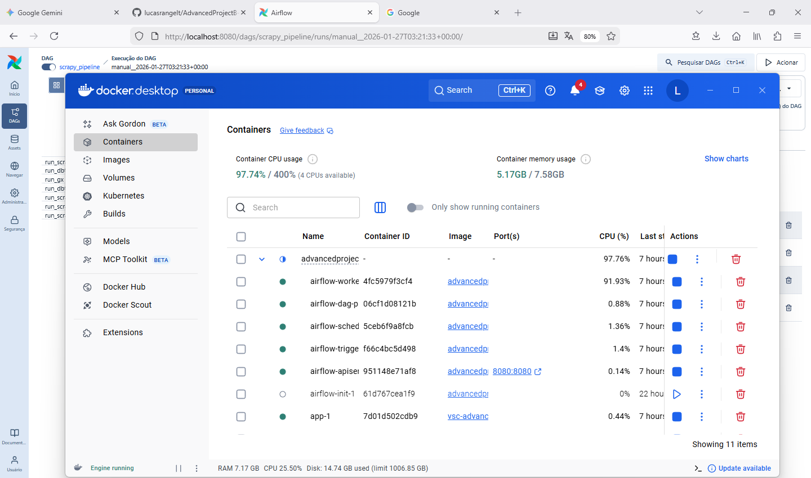

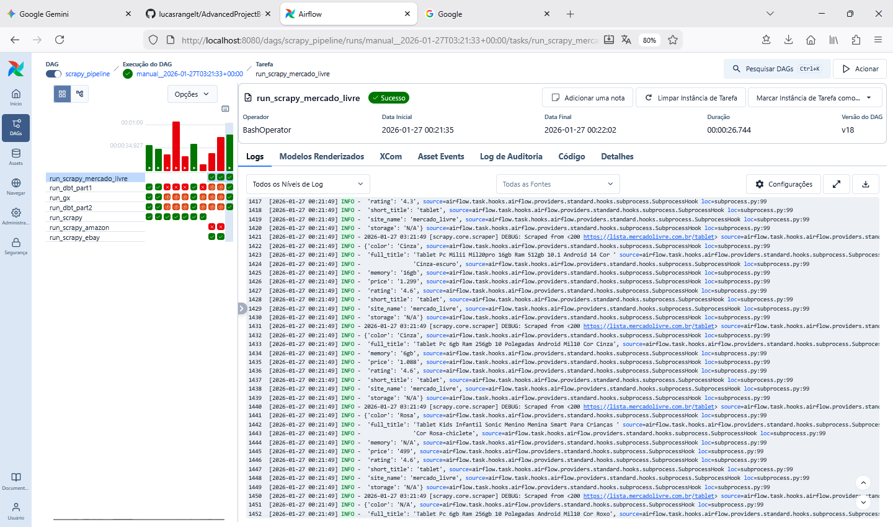

Dia 16: Corrigi minhas credenciais e tornei elas secretas com o arquivo .env e comecei a implementar Github Actions para CI/CD.

Dia 17: Corrigi erros de referência de credenciais e terminei de implementar GitHub Actions.

Dia 18: Planejei e enfrentei problemas de permissão no Azure devido a minha conta de universitário. Não consegui criar nova conta.

Dia 19: Planejei, explorei o AWS e comecei os preparativos para subir o projeto para a nuvem.

Dia 20: Criei toda a infraestrutura na nuvem e subi meu scraper para o ECR da AWS. Integrei o Airflow com a nuvem.

Dia 21: Criei uma base de dados PostgreSQL na nuvem e corrigi mapeamentos de chaves e passwords.

Dia 22: Corrigi os principais bugs, erros de permissões, etc. efetivamente concluindo a pipeline e o projeto principal.

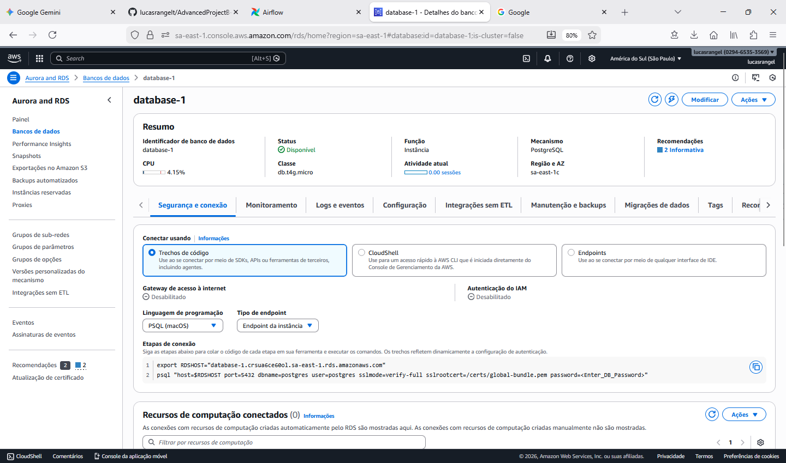

Dia 23: Corrigi bugs silenciosos e resolvi fazer o Scrapy executar de forma local para evitar proxies.

Dia 24: Escalei o scrapy, mudando o código para fazer scraping de 5 itens e adicionei novos scrapers para mais sites.

Dia 25: Reuni informações para trabalhar no arquivo ReadMe.md e garantir uma boa apresentação do projeto.

Dia 26: Enfrentei erros "anti-bots" em vários sites no scrapy; atualizei meu ReadMe.md e coletei imagens para visualizações.

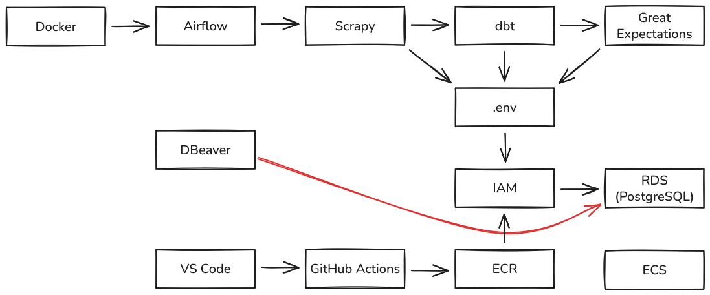

# Aprendizados

Aprendi a desenvolver uma pipeline de dados do começo ao fim utilizando ferramentas padrão de indústria para resolver cada uma das partes do sistema. Algumas ferramentas eu já tinha experiência, mas a maioria delas era novidade para mim. Apesar disso, consegui desenvolver bem as minhas ideias, graças ao vários recursos que busquei. Entre os vários aprendizados que obtive, eis os principais que poderão me ajudar para eventos futuros:

- Aprendi várias templates de arquivos como Dockerfile, docker-compose.yml, main.yml, DAG.py, etc.
- Não "forçar" a template da versão de uma ferramenta para outra versão.
- Focar na segurança, arquitetura e infraestrutura do projeto primeiro e apenas depois na sintaxe das ferramentas.
- Aprendi como funciona todo o ciclo de uma pipeline, o processo de coleta (API Endpoint/Scrapy/outras possíveis ferramentas), modelagem (dbt), qualidade (GX), armazenamento (PostgreSQL/RDS), orquestramento (Airflow), etc.
- Sempre começar um projeto utilizando .env quando necessário, em vez de implementar depois.
- Ao criar uma base de dados no AWS, apenas uma instância será criada. O nome dela será postgres, apesar de algum outro nome escolhido. Para resolver isso, deve-se entrar no DBeaver (ou na ferramenta de visualização utilizada), conectar-se à instância na nuvem e criar uma com o nome desejado.

# Créditos e Referências

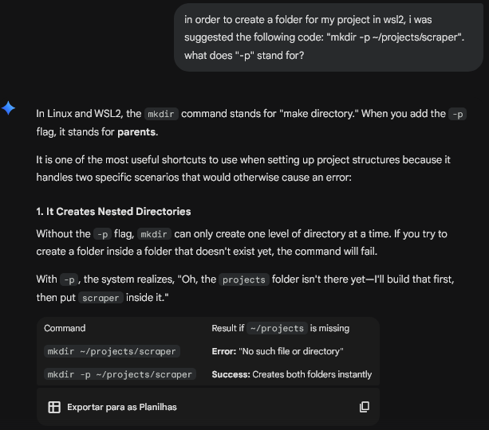
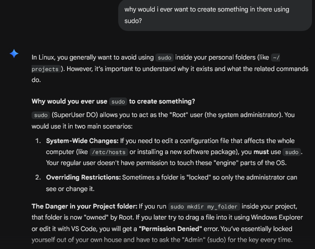
---
---
---
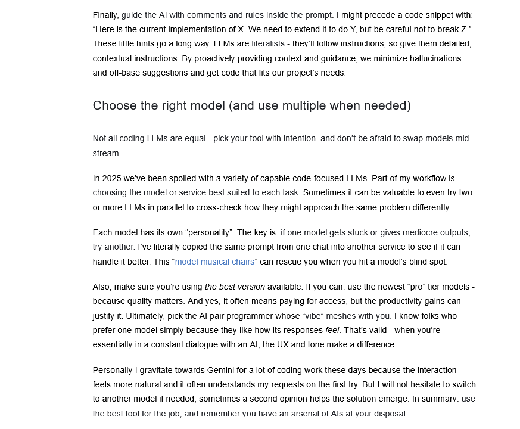
---
---
---
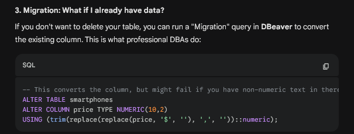
---
---
---

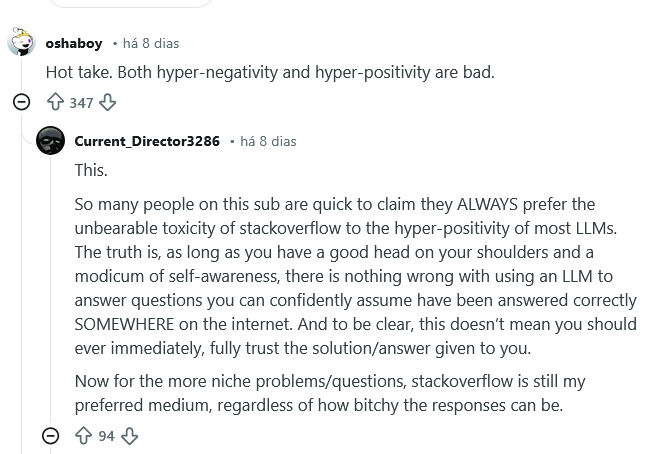
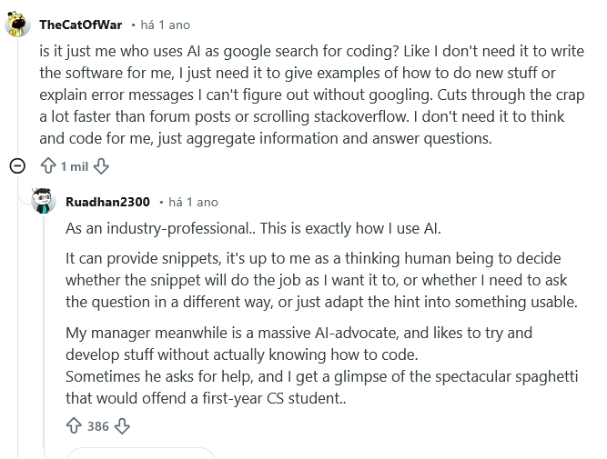
---
---
---
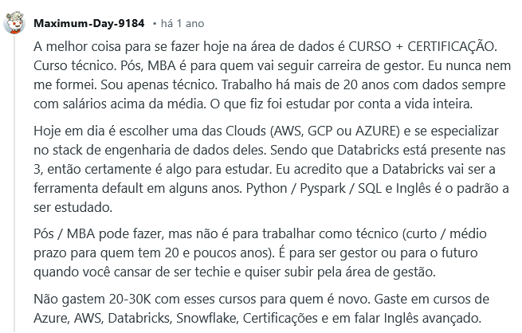
---
---
---
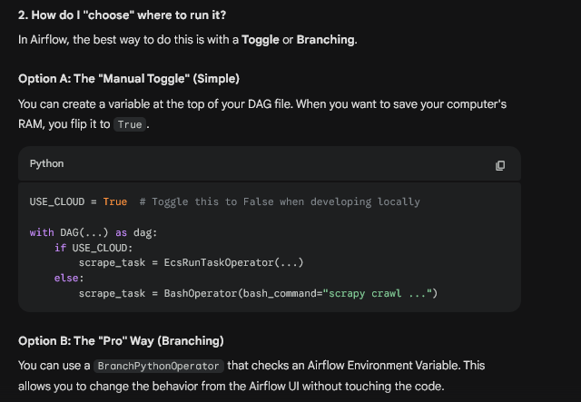

### Links

- Projeto Tutorial de Python: https://github.com/lucasrangelt/PYTHONproject
- Projeto Tutorial de SQL: https://github.com/lucasrangelt/SQLcourse
- Plataforma de Diagramação: https://excalidraw.com/
- Tutorial de Airflow/AWS: https://www.youtube.com/watch?v=o88LNQDH2uI
- Tutorial para Instalar Airflow no Docker: https://www.youtube.com/watch?v=ma8OuIz-ai0
- Airflow 3.1.5 (Documentação): https://airflow.apache.org/docs/apache-airflow/stable/howto/docker-compose/index.html
- Para referência e Debug: https://www.startdataengineering.com/
- Curso de Engenharia de Dados da IBM: https://www.coursera.org/professional-certificates/ibm-data-engineer
---
---
---
### Links do Gemini

- Tactical Executions: https://gemini.google.com/share/9b04f1af5a43
- Implement the things you need to learn: https://gemini.google.com/share/860923366ed0
- What is each thing: https://gemini.google.com/share/68a31589e27b
- Dbt Source YAML Comparison: https://gemini.google.com/share/1272ec020734
- Data Engineering and Web Scraping Frequency: https://gemini.google.com/share/4834319f82fd

### Uso da IA

Neste projeto, eu descobri o que significa usar a inteligência artificial como ferramenta de desenvolvimento na prática. Apesar da IA ajudar com algumas sugestões, se não forem ideais e o desenvolvedor aceitar e se aprofundar nelas, o controle do "leme" pode ser perdido.

A IA é como aquele veterano de guerra que, devido à idade, pode acabar "aumentando" ou "trocando as coisas de espaço temporal". Por exemplo, ele pode começar a falar sobre como "a Alemanha Oriental é um país ultrapassado, que vai contra a democracia e os direitos dos seus cidadãos", e aí você lembra ele de que a Alemanha se unificou há mais de 30 anos e ele responde com "Você está absolutamente certo!!" e começa a concordar e a contar coisas. Ele tem muito a ensinar, mas quem está ouvindo deve ter ou um pouco de conhecimento prévio, ou um lugar seguro para testar o que foi ouvido antes de sair espalhando informação desatualizada.

Na maioria dos casos que a IA "alucinou" foi em relação às interfaces de usuário (UI), como DBeaver, o que faz sentido, pois é mais fácil para ela trabalhar com elementos de texto e lógica do que botões em uma tela que ela não consegue ver.

Se a IA não "te dá a resposta que você quer", é praticamente 100% por causa do jeito que a questão foi formulada: Se você esquecer alguma coisa ou deixar muito vago, a resposta pode não vir muito bem detalhada. Isso pode ser ruim para problemas específicos, ou bom para quem quer sugestões iniciais. Se exagerar nos detalhes, pode-se receber a resposta para 5 ou 6 tipos de problemas quando mal se tem acesso a um deles. Trabalhar com a IA me ensinou jeitos otimizados de se fazer perguntas para resolver problemas.

Ressaltando que, apesar das várias boas sugestões que recebi, no final eu soube assumir o controle e filtrar as que não me agradava. Eis a seguir algumas dessas sugestões (que também provavelmente serão encontradas em algum lugar da conversa "Tactical Executions"):

- IA me sugeriu utilizar o BeautifulSoup. Após comparar, escolhi o Scrapy, visando escalabilidade e performance.
- IA sugeriu que eu fizesse scraping apenas de um site, mas construi outros scrapers para confirmar a escalabilidade.
- IA sugeriu colocar o "docker-compose.yml" dentro da .devcontainers. Segui a sugestão, mas acabei puxando para a root depois.
- IA sugeriu colocar minhas credenciais nos scripts python (clássico). Eu usei .env devido aos riscos de segurança. 
- IA sugeriu Airflow 2.7.1. Eu escolhi Airflow 3.1.5 por ser mais atualizado.
- IA sugeriu sintaxe desatualizada para importar dependências no GX. Verifiquei a documentação e atualizei o código.
- Decidi deletar todas as minhas imagens e volumes (menos o Postgres) e reconstruir para ver se funcionava normal.
- IA me sugeriu seguir Scrapy >>> dbt >>> GX no Airflow. Escolhi Scrapy >>> dbt >>> GX >>> dbt para filtrar dados antes de carregar.
- IA me sugeriu usar o termo "prod" no GitHub Actions. Preferi usar o target "ci" por parecer mais apropriado.
- IA me sugeriu usar variáveis env como "DB_USER". Escolhi "ENV_USER" pela relação próxima com códigos relacionados.
- IA me sugeriu usar um comando bash para instalar AWS CLI para meu aplicativo em container. Escolhi instalar no Dockerfile.
- IA me sugeriu restringir para que apenas minha "main" branch publicasse no AWS. Permiti todas, a fim de testar possibilidades.

**Meu e-mail: lucasrangel2011@gmail.com**

**Meu LinkedIn: https://www.linkedin.com/in/lucas-rangel-tietbohl-29791237b/**